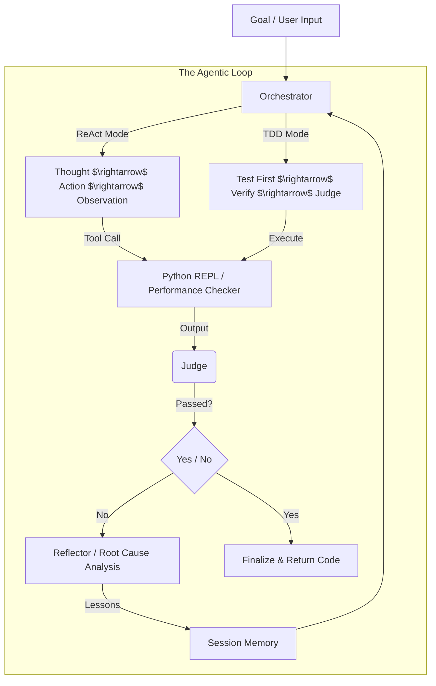

# Agent Loop: The Next-Gen Agentic Framework

A highly optimized, stateful AI coding agent written in Go. Unlike linear Python pipelines, this framework implements a **"Code $\rightarrow$ Verify $\rightarrow$ Reflect"** loop, ensuring the agent learns from mistakes and uses tooling to verify its own logic.

## Architecture Diagram



## Core Philosophy
**"Don't assume, verify."**
The agent never outputs code it hasn't proven correct through execution (sandboxing & timeouts) or formal testing.

## Key Modules

1.  **Orchestrator (The Brain)**: State machine managing the loop flow (ReAct, TDD, or standard).
2.  **Executor (The SandBox)**: Strict process management. No code runs without a timeout (usually `2s` per step, up to `5m` for TDD).
3.  **Judge (The Eye)**: Evaluates execution output against `Expectations`.
4.  **Reflector (The Teacher)**: Analyzes *why* a verification failed and extracts reusable **Lessons** to prevent future loop iterations from making the same mistake.
5.  **SessionMemory (The Long-Term Store)**: A persistent state (JSON/SQLite) that stores:
    - **Hypotheses**: "The algorithm is too slow, I should try dynamic programming."
    - **Lessons**: "The Python `time` library failed on local execution."
    - **ReAct History**: A log of all tool calls and results to give the agent "context" across turns.
6.  **Agent Tools (Hands)**:
    - `PythonREPL`: Arbitrary python execution for math and logic verification.
    - `PerformanceChecker`: Verifies if a script meets time/memory constraints.

## How to Use

### Prerequisites
- Go 1.21+
- Ollama (running locally)
- Model: `qwen2.5-coder:32b` (Recommended for 24GB+ VRAM/RAM)

### Quick Start

1. Pull the model: `ollama pull qwen2.5-coder:32b`
2. Run the agent:
   ```bash
   go run main.go
   ```

### Real Developer Usage
Edit `main.go` and define a complex goal. The agent will automatically decide if it needs to **ReAct** (use tools to verify) or **TDD** (generate tests first).

## Design Patterns Implemented

- **Controller-Worker**: Orchestrator drives state; Executors/Judges perform work.
- **ReAct Pattern**: Thought $\rightarrow$ Action $\rightarrow$ Observation loop for tool usage.
- **TDD Engine**: Explicit role-play switch between "QA Engineer" (test generation) and "Coder" (solution generation).
- **Self-Correction Loop**: If a test fails, the Reflector diagnoses the root cause (Logic vs. Oracle vs. Syntax) before retrying.
